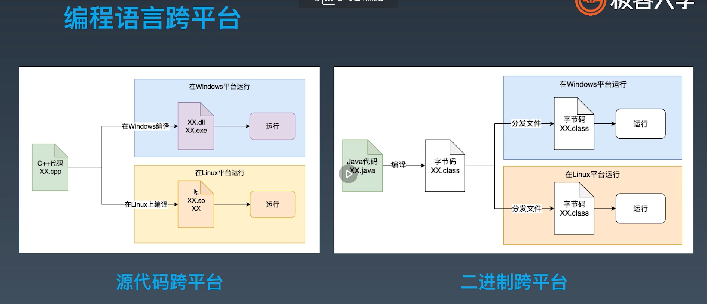

```
学习笔记
· JVM 基础知识
   - 高级语言特性回顾->
     特性1.面向过程、面向对象、面向函数
     特性2.静态类型、动态类型
     特性3.编译执行、解释执行
     特性4.有虚拟机、无虚拟机
     特性5.有 GC 、无 GC 
     - Java 语言特性：面向对象、静态类型、编译执行、有 VM/GC 和运行时、跨平台。
       - 跨平台编码运行流程
       	C++: 编写出 .cpp 文件后，在 Window 环境中编译成 .exe 程序，然后运行。
       	Java：编写出 .java 文件后，编译成 .class 字节码文件，然后分发到 Window 、Linux 环境中运行。
       	C++ 是源代码跨平台， Java 是二进制跨平台。
       	
       - 字节码、类加载器、虚拟机
        生成字节码文件后，类加载器会将其中的类加载到虚拟机中，然后初始化之后就有了类的对象实例。
        
        字节码文件由源代码编译成。
        ？JVM 虚拟机中占用的内存也就是对象是怎么被管理的。
    
· JVM 字节码技术
     - 字节码相关知识
        
        例子1，编译一个类
            
            
                load 压栈
                store 从栈写到本地变量
        例子2，编译一个更复杂的类
            
        - 字节码运行时
            
        - ？助记符在8个字节中是怎样表示的
            
        例子3，编译一个四则运算的类
            
            编译后
            
            
            
            操作数对照表
            
            左边是各类型的操作符，右边是类型转换
            *JVM 中最小的操作符类型是 int，当遇到比 int 小的类型时如 byte char bool 直接当int使用
        例子4，编译一个for循环的类
            
            编译后
            
            
            
     - 方法调用指令
        
     - 一个动态调用的例子
        
· JVM 类加载器
    
· JVM 内存模型
· JVM 启动参数
· 第一小节回顾

javac Hello.java -encoding utf-8 
```

